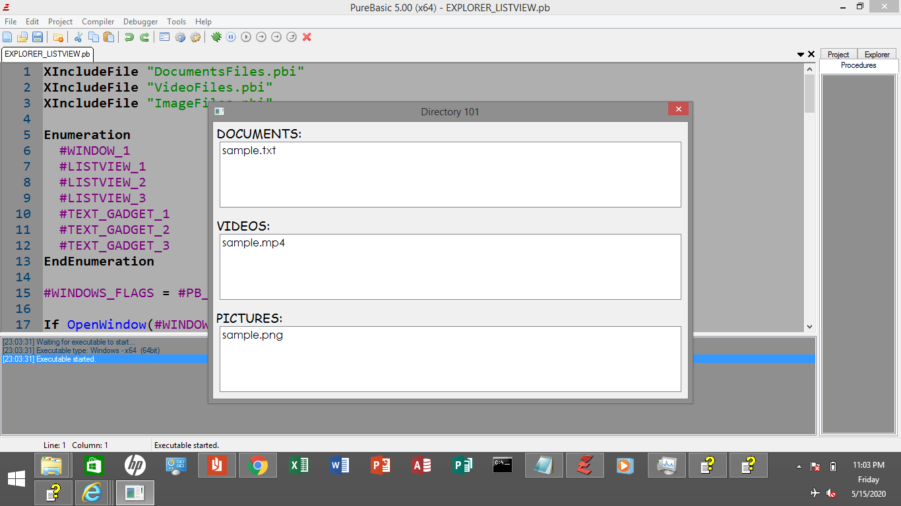

# PureBasic File Explorer

*`updated 22 April 2022`*

This is a file explorer written in PureBasic.
This is the very first release and there are too many things you can add here.

Why do we need a file explorer?
When you want to write an operating system, this is a must.

Just put everything inside the DIRECTORY_101,
the computer is the one assigned to sort files according to format
and this is due to the algorithm included in the source code.

When you already compiled the source code,
you run the executable file and
you will be seeing these things:

for Documents, the default file extensions are:  
.txt  
.pdf  
.docx  

for Videos, the default file extensions are:  
.mp4  
.avi  

for Pictures, the default file extensions are:  
.png  
.jpg   

## Compiling
To compile/run, just use the PureBasic IDE, that's very fast and
simple for simple programs like this.

## Contributing
1. Fork it!
2. Then, made changes, and create a pull request. I'm happy you contribute to my repo!

## License
MIT- The permissive license
